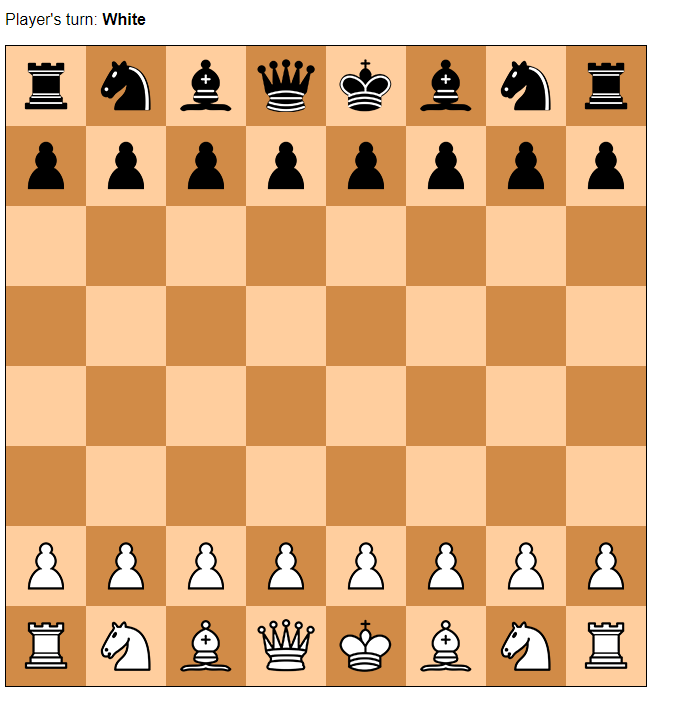
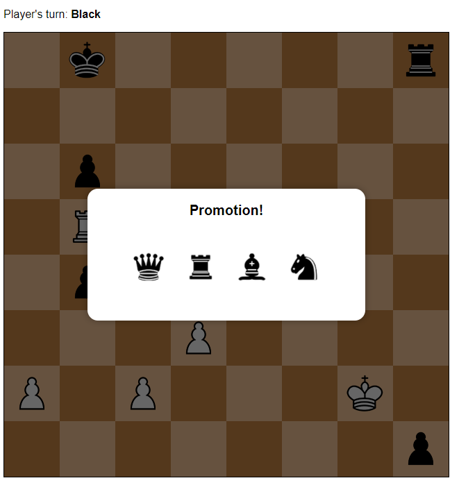

# Chess

Live Demo: https://mshvarts.github.io/Chess/

A two-player chess game written in JavaScript, HTML, and CSS. 
 
I was responsible for writing the game logic (including special moves such as Castling, Promotion, and En Passant), which makes up over a thousand lines of code in total.

This was made as a two-member group project for a web development class at Langara College.    

### Screenshot:  

